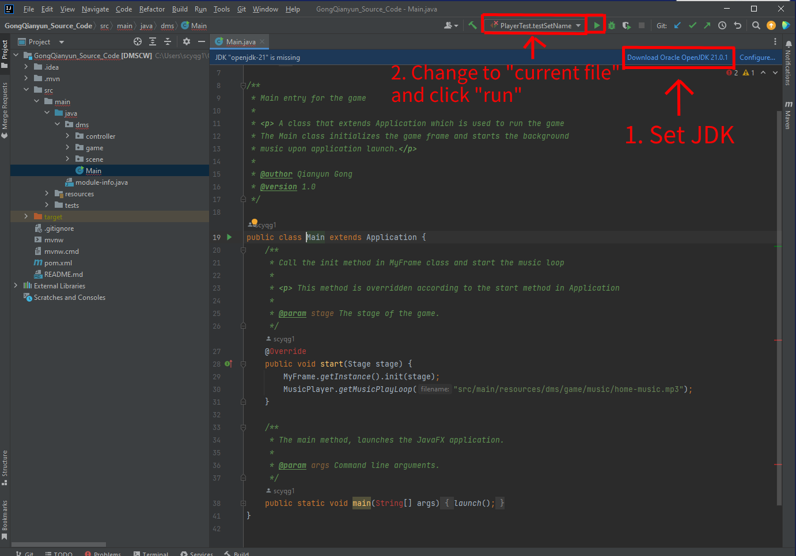

# Snake Game (COMP2013 CW)

## Author
Qianyun Gong : scqg1@nottingham.ac.uk </li>

## Brief project description
This project aims to develop and maintain a snake game using JavaFX as UI design tool.
Some interesting functions, such as AI enemy and shooting, are implemented, and the customization options meet the needs of different groups of people.

## How to install and run the project
1. Depress all the folders in this project.
2. Open the "GongQianyun_Source_Code" folder in IntelliJ IDEA (or other IDE) and set the JDK of this project by following the prompt, whether downloading or using existing one.
3. Set the file to be "current file" and click the "run" button to load the game.

## How to play the game
In the home page, click the "Feedback & help" to see the tutorial on how to press the keyboard and provide feedbacks.
When clicking "Cool Mode", the theme mode will be changed.
When clicking "Rank Board", the rank history will be displayed.
After entering the name, click "Start" and go to the menu page.

In the menu page, the player could choose the game mode, theme, snake appearance and the music.
If choosing the human voice prompt, there will be voice prompt when pressing keyboard and changing states.
If not choosing any choice, it will be recognized as the default setting.
Then, click "Play" to start playing.

During the game, press the direction button on the keyboard to control the snake.
Also, pressing "Space" for pause or continue, "S" for shooting and "E" for ending the game. 

When game ends, the score information will be displayed. 
There are some buttons to reset, play again, exit or log out.

## Credits
Pictures and musics from other resources :

https://sc.chinaz.com/yinxiao/231024289060.htm

https://www.huitu.com/design/show/20210327/214607943070.html

https://www.mksucai.com/png/qglzoool.html

https://616pic.com/sucai/vd9ipg73j.html

https://www.mksucai.com/png/qgemaplv.html

https://www.mksucai.com/down/yjegwlrr.html

https://shipin520.com/sp-406093.html

https://sc.chinaz.com/yinxiao/220716437921.htm

https://sc.chinaz.com/yinxiao/220617536221.htm

https://www.uitubang.com/7837.html

https://m.51miz.com/sucai/1301240.html

https://www.shejihz.com/archives/96350/

https://img.magiclen.org/albums/slither-io/skin.png.jpg